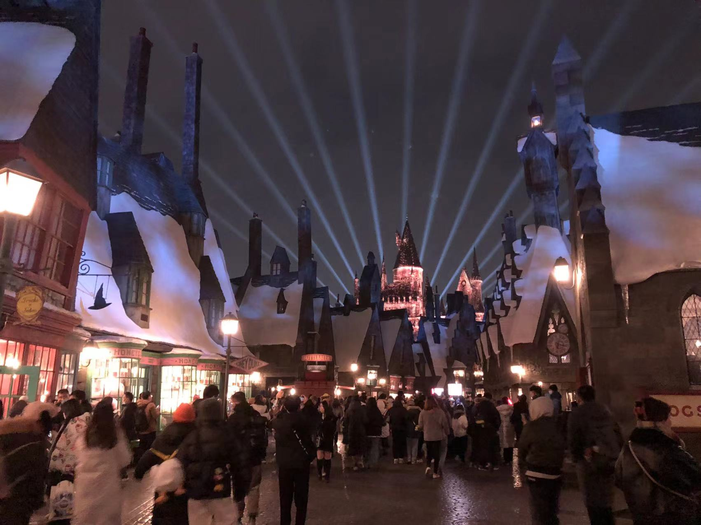

# This is my Org's profile
## Hi there 👋

<!--

**Here are some ideas to get you started:**

🙋‍♀️ A short introduction - what is your organization all about?
🌈 Contribution guidelines - how can the community get involved?
👩‍💻 Useful resources - where can the community find your docs? Is there anything else the community should know?
🍿 Fun facts - what does your team eat for breakfast?
🧙 Remember, you can do mighty things with the power of [Markdown](https://docs.github.com/github/writing-on-github/getting-started-with-writing-and-formatting-on-github/basic-writing-and-formatting-syntax)
-->
- This is Jiaming Wang. 

- wjm237@126.com

I start my Thoughtwork's gtb training here!

In my spare time, I have broad hobbies.

🍿Recently, I'm especially into movies and TV series.

Like these days, I was following *'Euphoria'* Season 2.

Also, I went to **Universal Studios Beijing** and have had so much fun there.

🧙

